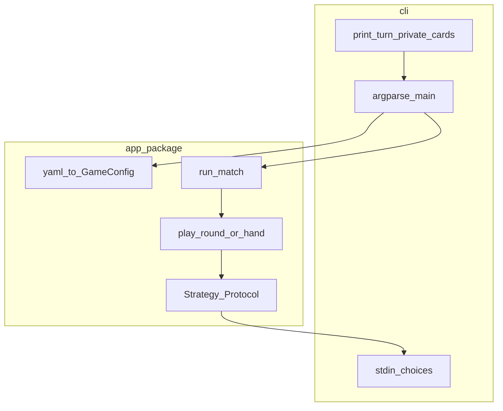

# Implementation plan: genetic-betting (engine + hotseat CLI)

## Deliverable for this planning step

After you approve this plan, an agent should **add a single file** in the repo: `[docs/implementation-plan.md](docs/implementation-plan.md)`, containing the **task list below** (with stable IDs), dependency notes, and architecture summary—so you can later say “execute task T3” without relying on Cursor’s internal plan store.

---

## Dependencies (rationale)

| Need             | Package  | How to add (per `[.cursor/rules/dependencies-uv.mdc](.cursor/rules/dependencies-uv.mdc)`) |
| ---------------- | -------- | ----------------------------------------------------------------------------------------- |
| YAML game config | `pyyaml` | `uv add pyyaml`                                                                           |
| Tests            | `pytest` | `uv add --dev pytest`                                                                     |

**No installable distribution**: do **not** add a build backend (e.g. hatchling), `[project.scripts]`, or wheel layout for v1. The app is run as `**uv run python -m app.cli`** (or `uv run python app/cli.py` if you prefer a script entry without `-m`). Tests use `**[tool.pytest.ini_options] pythonpath = ["."]`** so `import app....` resolves from the repo root without `pip install -e .`.

**Stdlib only** on the hot path: `random.Random` (injected), `dataclasses`, `enum`/`typing`, `argparse` for CLI.

**Optional later** (not required for v1): `ruff`/`mypy`, benchmark script only uses `time.perf_counter`.

---

## Architecture (targets in [AGENTS.md](AGENTS.md))

Keep the **simulation core** free of print/input; the CLI is a thin driver.

- `**GameConfig**`: loaded from `[config/game.example.yaml](config/game.example.yaml)` (copy path via CLI `--config`); all monetary fields `**int` dollars**.
- `**Strategy` protocol**: `choose_action(rng, view_for_actor, legal_actions) -> Action`. Engine passes a **view** that exposes only what that seat should see (for hotseat: **own card**, balances, pot, betting state—not opponent’s card until showdown).
- `**play_hand` / `play_round`** (name TBD): ante → deal → betting FSM per rules → refunds if needed → distribute pot; return structured outcome for tests/CLI.
- `**run_match`**: repeat hands until bankrupt or `max_rounds_per_match`; **alternate first actor** each hand as in [AGENTS.md](AGENTS.md).

**Betting FSM** (no re-raise): encode explicitly from [AGENTS.md](AGENTS.md)—P1 raise → P2 fold/call; P1 check → P2 check/raise in `[min_raise, max_raise]`; P2 raise → P1 fold/call. **Legal raises**: enumerate integer dollars in range capped by actor’s **wallet** (cannot raise more than stack allows).

**All-in / refund**: when commitments cannot equalize, refund excess to the over-committed player before awarding the contested pot (document invariants in module docstring or short comment block).

---

## End goal (agreed)

- **Local CLI**, **two humans, one terminal (hotseat)**.
- **Privacy**: each prompt shows **only the current player’s card**; opponent’s card appears at **showdown** (or when hand ends by fold—no need to reveal folded card unless you want it; default: **reveal at showdown only**).

---

## Tasks (execute in order; each has a clear “done” criterion)

**T1 — Project scaffold (simple app, not an installable package)**  

- Layout: an `**app/`** directory with normal modules (e.g. `app/cli.py`, `app/config.py`, …). This is only a **Python import package** for clean splits—not something you `pip install` or publish.  
- `[pyproject.toml](pyproject.toml)`: keep `**requires-python >=3.13`** and dependencies managed by `**uv add`** / `**uv add --dev`** only. **No** `[build-system]`, **no** `[project.scripts]`, **no** hatchling/setuptools wheel config.  
- Pytest: set `**pythonpath = ["."]`** (or equivalent) so tests can `import app....` from the repo root.  
- **Done**: `uv sync` succeeds; `uv run python -m app.cli --help` (or the chosen entry) runs without installing an editable package.

**T2 — Example YAML + `GameConfig`**  

- Add `[config/game.example.yaml](config/game.example.yaml)` with keys: `starting_stack`, `ante`, `min_raise`, `max_raise`, `max_rounds_per_match`, `card_min`, `card_max` (all ints; names can match a consistent snake_case schema).  
- Implement `load_game_config(path) -> GameConfig` with validation (`ante > 0`, `min_raise <= max_raise`, stacks sufficient for ante, card range sane).  
- **Done**: unit test loads example file without error; invalid YAML/values raise clear errors.

**T3 — Actions and public view types**  

- Frozen/small types: `Action` (`check`, `fold`, `call`, `raise` with `amount_dollars` where applicable).  
- `ActorView` (or similar): fields needed for strategies + CLI (balances, pot, own card, street state, who is to act, legal raise bounds).  
- **Done**: tests construct actions and views without importing engine FSM.

**T4 — Single-hand engine**  

- Implement betting + showdown + pot split (odd dollar to player 0) + refunds.  
- Injected `random.Random` for deals.  
- **Done**: pytest table cases for every branch in [AGENTS.md](AGENTS.md) Game rules + conservation `sum(wallets)+pot` constant across a hand after refunds.

**T5 — Match loop**  

- `run_match(config, strategies, rng) -> MatchResult` (winner id, final balances, reason).  
- Alternate first player each hand.  
- **Done**: tests for max-round cap, bankruptcy, and first-actor alternation over multiple hands (can use fixed RNG + scripted strategies).

**T6 — Strategies: scripted + random**  

- `ScriptedStrategy` (list/queue of actions) for tests.  
- `RandomLegalStrategy` for smoke tests / future bots.  
- **Done**: at least one integration test runs a full match with scripted strategies deterministically.

**T7 — Hotseat CLI**  

- `app/cli.py` (or equivalent): `--config` defaulting to `config/game.example.yaml`, loop calling `run_match` or lower-level “one hand at a time” driver with printed prompts.  
- Menus: map keys/digits to fold/call/check and raise amount selection when legal (list valid raise integers).  
- **Done**: two people can complete one match locally; no opponent card leak before showdown.

**T8 — Documentation**  

- Update `[README.md](README.md)`: prerequisites (`uv`), `uv sync`, how to run the console script, config file meaning.  
- **Done**: new user can play without reading source.

**T9 — Optional benchmark** (stretch)  

- `[scripts/benchmark_hands.py](scripts/benchmark_hands.py)`: N hands with `RandomLegalStrategy`, print hands/sec.  
- **Done**: `uv run python scripts/benchmark_hands.py` runs.

---

## Suggested amendments

- Reveal opponent’s card on fold (informational) vs showdown-only.  
- Add `max_hands_per_match` vs `max_rounds_per_match` naming (align YAML key with [AGENTS.md](AGENTS.md) wording).  
- Typer/Click instead of argparse (adds a dependency—only if you want richer CLI).

